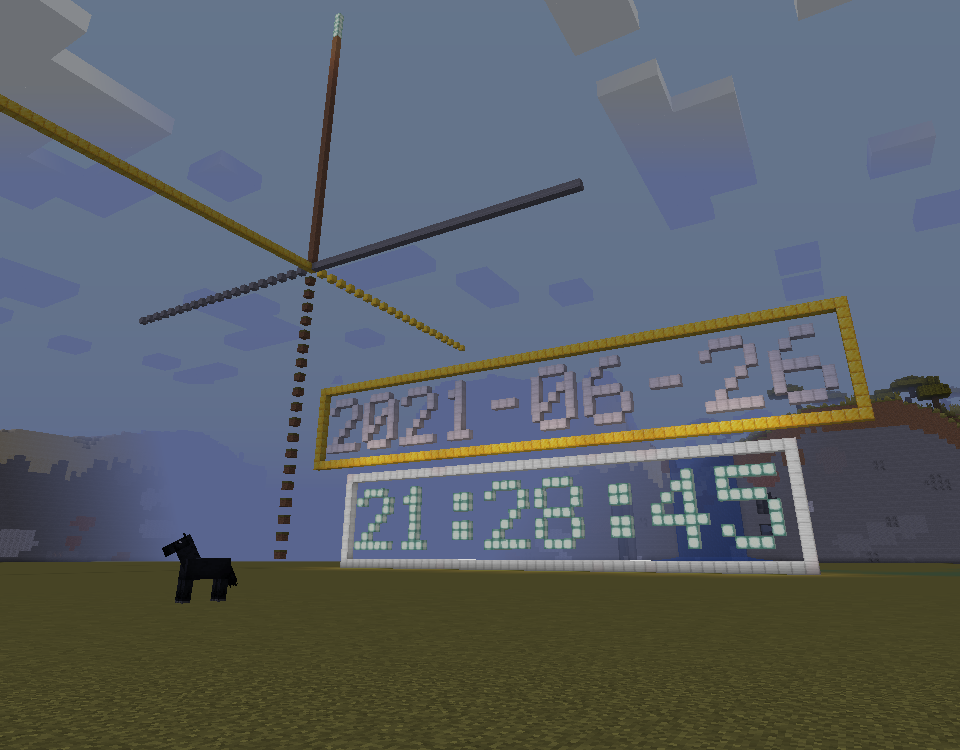

# Naohiro2g/minecraft_remote

|[1.13 Update Aquatic](https://www.youtube.com/watch?v=hcutClmY1pI)|[1.16 Nether update](https://www.youtube.com/watch?v=1DhWXAiNgfQ)|
|--|--|
|[](./1.13_update_aquatic.jpg)|[](./1.16_nether_update.png)|

You can control over Minecraft Java Edition Version 1.16.5 in Scratch 3 or Python.


## Remote control over Minecraft in Python / Scratch
[**(Japanese here.  (not yet))**](README_ja.md)

By using the Minecraft API and coding in Scratch or Python, you can place blocks and move Steve around, and more.

As you know, it is of course fun to do such things manually in the Minecraft world, but it is also fun to code and automatically remote control. And it's an excellent subject to get you interested in learning Scratch or Python.

In my class, we even include the use of git and GitHub.com, which is a fun self-study material for both young learners and experienced ones. **It's a great way to learn a programming language by having something you want to do first.**

I believe the same is true for learning a foreign language. **Don't learn the language, use the language.** (I've just created the 'quote' now. ;) )

## Editions / versions and environments
|Minecraft|Forge|mod|Python module|Scratch + Extension|
|---|---|---|---|---|
|Pi Edition (MCPI) Raspbery Pi|-|-|[mcpi](https://github.com/martinohanlon/mcpi)|Scratch 1.4 + [Scratch2MCPI](https://github.com/scratch2mcpi/scratch2mcpi)|
|Java Edition (MCJE) 1.12.2|[Forge 1.12.2](https://files.minecraftforge.net/net/minecraftforge/forge/index_1.12.2.html)|[RemoteControllerMod-1.12.2 v0.02](https://www.curseforge.com/minecraft/mc-mods/remote-controller/files/3242375)|[mcpi](https://github.com/martinohanlon/mcpi)|[Scratch 3 + MC Ext 1.12.2](https://takecx.github.io/scratch-gui/1-12-2/)|
|Java Edition (MCJE) 1.16.5|[Forge 1.16.5](https://files.minecraftforge.net/net/minecraftforge/forge/index_1.16.5.html)|[RemoteControllerMod-1.16.5 v0.05](https://www.curseforge.com/minecraft/mc-mods/remote-controller/files/3363255)|[mcje](./mcje)|[Scratch 3 + MC Ext 1.16.5](https://takecx.github.io/scratch-gui/1-16-5/)|

You can run Minecraft Java Edition on Linux including Raspberry Pi, Mac and PC. Unfortunately, at least so far, new comer who cannnot have Mojang account are unable to launch the app on Raspberry Pi.

The changes of Minecraft Java Edition at 1.13 "Update Aquatic" were so significant that we were forced to stay with 1.12.2 for three long years in remote control over Minecraft. We broke thruough it by the huge effort of [takecx](https://github.com/takecx), then made it possible to work with version 1.16.5.

But, once again, the changes at version 1.17 was pretty large. For the compatibility with the latest version of Minecraft-Forge 1.17, please wait for a while to cope with it. Or, rather concider to join force with us for the development of [RemoteControllerMod](https://github.com/takecx/RemoteControllerMod) on GitHub.com to reduce the wait.

(The black horse is thinking... to help us?)
[](./minecraft_remote_digitalclock.png)

## Examples to draw something in the Minecraft world by voxels or volume pixels
Sorry, examples are only in Python, not for Scratch, so far. See [takecy's](https://github.com/takecx/RemoteControllerMod) to start in Scratch.
 - [hello_MCPI.py](./hello_MCPI.py), [hello_MCJE.py](./hello_MCJE.py), [hello_MCJE1122.py](./hello_MCJE1122.py) : Typical Hello World code. **Try this first to learn how to select Python module mcpi or mcje for your environment.** Install mcpi from Pypi with this. ``` pip3 install mcpi --user ``` or ``` pip install mcpi --user ```

 - digitalclock.py to display a realtim clock with time and date using 5 x 7, LCD font in the format as follows (also shown in the picture above):
```
        2021-06-26
         21:28:45
```
Using hand-made LCD font on double-buffer display, you can learn 'class'.  I prefer SEA_LANTERN_BLOCK for the time display but unfortunately it's not available in MCPI.
 - axis_flat.py : Module to draw x, y, and z-axis and to flatten the world in addition. Nice and useful utilities to prepare the world for learning.
  Axes with the virtual origin at (0, 80, 0) for MCJE, or (0, 20, 0) for MCPI using block types as follows:
    - x-axis: Stone blocks
    - y-axis: Grass on soil blocks
    - z-axis: Gold blocks
 - demo1.py, demo2.py : Usage of axis_flat or double_buffer_display modules.

You might think learning axes or axis are too difficult and too early for age 8, but it's not true. If you are thinking to teach them, it's true. Just try to assist kids learning. Umm, I'm just playing with them, actually.

## Files used in the digital clock
#### [digitalclock.py](./digitalclock.py)
 - Main file to run by ```python digitalclock.py```
 - Using two display instances, for date and time, respectively.
 - You need to select a python module from mcpi or mcje to use.
#### [double_buffer_display.py](./double_buffer_display.py)
 - Class BufferDisplay
 - Display class with two flipping buffers to draw only changes from the last time.
 - You need to select a python module from mcpi or mcje to use.
#### [font_5x7.py](./font_5x7.py)
 - 5 x 7 LCD font design
#### [param_MCJE.py](./param_MCJE.py), [param_MCJE1122.py](./param_MCJE1122.py), [param_MCPI.py](./param_MCPI.py)
 - Constant values of several block types, world size, and axis parameters
 - param_MCJE: for Minecraft Java Edition 1.16.5
 - param_MCJE1122: for Minecraft Java Edition 1.12.2
 - param_MCPI: for Minecraft Pi Edition
#### [mcje (minecraft java edition)](./mcje)
 - Python module forked from https://github.com/lasteamlab/mcpi2
 - Named as mcje, and updated for use of Minecraft Java Edition 1.13 or later.
 - It might be available in Pypi later.

## Preparation for Python, Java and other environment

(in the pipeline...)
 - Python 3.7.9
 - Java SE 8 JRE
